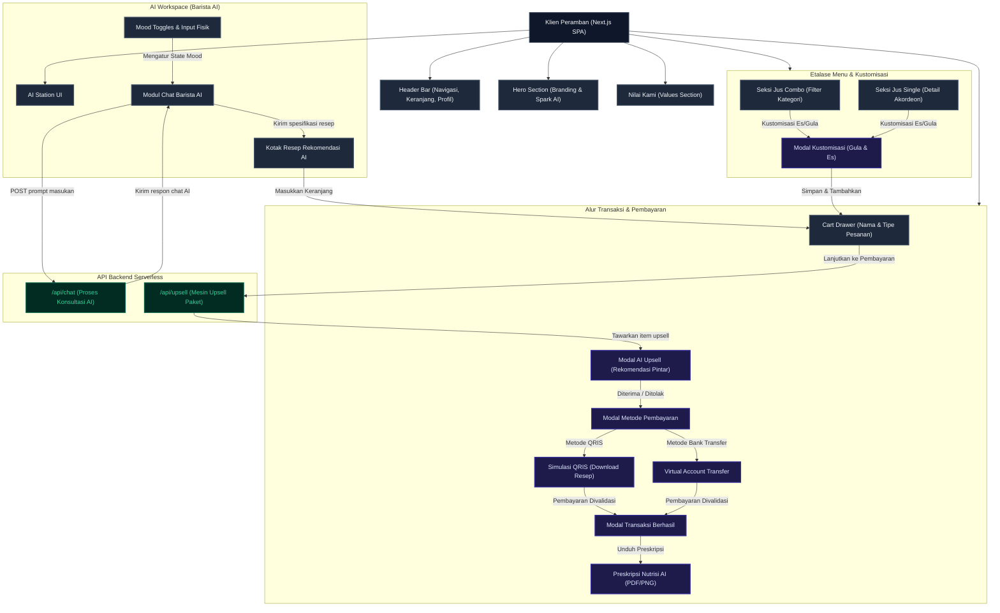

# Analisis Arsitektur VibeJuice

Dokumen ini mendeskripsikan arsitektur sistem dari web-app VibeJuice, memetakan hubungan antara komponen frontend, alur state management, serta integrasi dengan API backend berbasis AI.

---

## Arsitektur Sistem Utama

VibeJuice dibangun dengan arsitektur **Single Page Application (SPA)** berbasis **Next.js App Router** pada sisi frontend, dengan **Serverless API Routes** di sisi backend untuk mengelola fitur-fitur bertenaga AI secara aman.

### 1. Komponen Frontend (Client-Side)
* **`app/page.jsx`**: Satu-satunya entry point visual (SPA) yang mencakup seluruh seksi interaktif:
  * **Header**: Navigasi, keranjang belanja dinamis, profil login Google Simulator.
  * **Hero & Our Values**: Pengenalan brand dan nilai kesehatan.
  * **AI Station Workspace**: Integrasi modul kustomisasi mood dan chat interaktif dengan AI Barista.
  * **Menu Showcase**: Etalase produk jus Kombinasi (Combo) dan Jus Tunggal (Single).
  * **Modals Layer**: Modal Kustomisasi Es/Gula, Ulasan Pelanggan, Login Simulator, AI Upsell, Metode Pembayaran (QRIS/Transfer), dan Preskripsi Nutrisi AI (Unduh PDF).

### 2. Komponen Backend (Server-Side API Routes)
* **`/api/chat/route.js`**: Endpoint API yang menerima prompt masukan suasana hati (mood) pengguna dan memproses resep jus rekomendasi personal secara real-time.
* **`/api/upsell/route.js`**: Endpoint rekomendasi belanja pintar yang menganalisis isi keranjang belanja dan menawarkan produk pelengkap bernutrisi tinggi dengan diskon paket khusus.

---

## Diagram Alur Arsitektur (Flowchart)

Berikut adalah flowchart arsitektur lengkap VibeJuice menggunakan sintaksis Mermaid:

